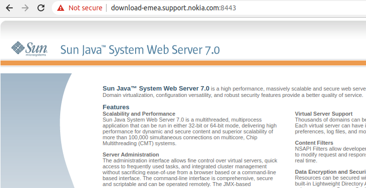

#### Hi Nokia Security Team i've found Some Bugs in download-emea.support.nokia.com:8443 

#### this page mean's the Sun Java System is worked .. with Dir Brute force i've found this Page 

#### Link : https://download-emea.support.nokia.com:8443/cgi-bin/test.cgi

#### awesome this a good informations .. we  can see all paths and HTTPS_KEYSIZE , USER-AGENT , COOKIES , IP , ETC ..

## Bug 1 (informations Disclosure)

### Description : 

#### in the page we can see important informations like PATH , LD_LIBRARY_PATH , PWD , and the user of server 

## Bug 2 (XSS) 

### Steps To Reproduce:
 * go to This <a href='https://download-emea.support.nokia.com:8443/cgi-bin/test.cgi'>link</a>
 * enter this payload in User-agent header or Cookies "> 
 

### impact :
#### With the help of xss a hacker or attacker can perform social engineering on users by redirecting them from real website to fake one. hacker can steal their cookies and download a malware on their system, and there are many more attacking scenarios a skilled attacker can perform with xss.

## Bug 3 (Full Account Takeover)
### Description :
#### X-Frame-option header not found in this page . now the attacker can be start a Click Jacking Attack and Take Screenshot and steal all cookies of user using iframe tag and javascript for get all Cookies
 * https://stackoverflow.com/questions/56543686/is-it-possible-to-to-take-a-screenshot-of-an-iframe-in-a-web-page
 * https://www.ask-sheldon.com/screenshot-scrollable-iframe/
### impact:
#### steal users and admins accounts
