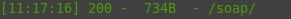
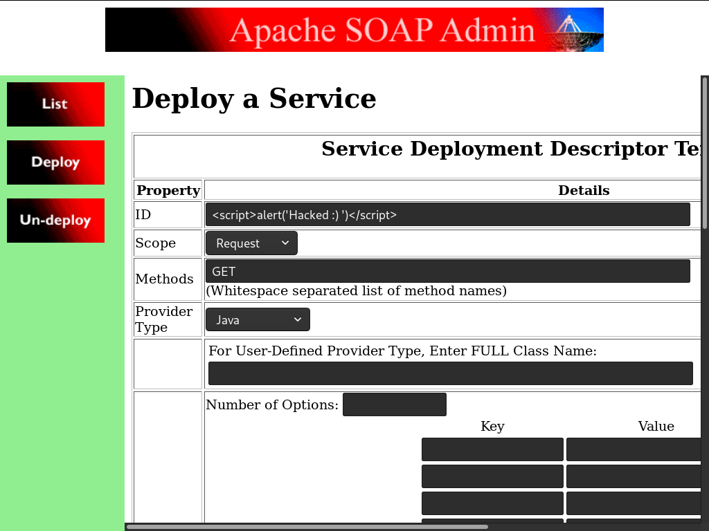
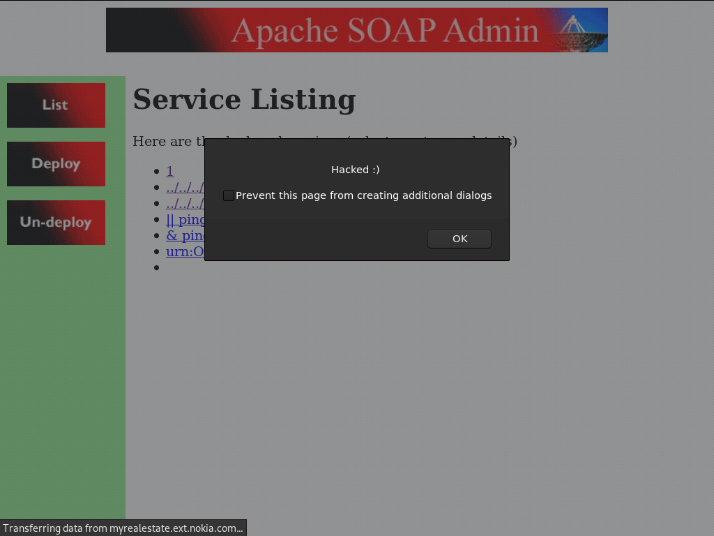
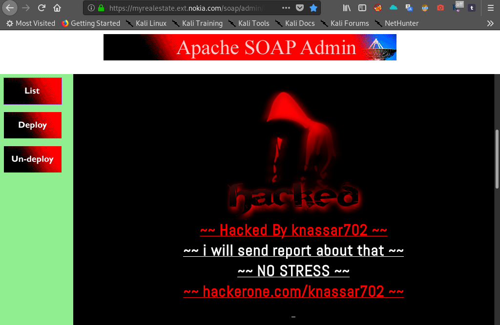
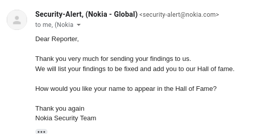

# XSS Stored
##### hi nokia security team . i have found xss stored in `https://myrealestate.ext.nokia.com , https://training.myrealestate.ext.nokia.com , https://test.myrealestate.ext.nokia.com`
##### when visite this domain we can see this message (```its work```) but with ```dirsearch Tool``` 
##### CMD
```
$ dirsearch -u https://myrealestate.ext.nokia.com -e php
```


### Nice lets Get XSS Stored :)
* Go to this path /soap/admin/index.html
* Click on Deploy Button
* Add this payload <script>alert('Hacked')</script> in ID input
* Click on Deploy




### Add The Code of my index ^_^


### Read about xss stored :
* https://www.owasp.org/index.php/Testing_for_Stored_Cross_site_scripting_(OTG-INPVAL-002)
* https://portswigger.net/web-security/cross-site-scripting/stored

## impact
##### XSS can use to steal cookies, password or to run arbitrary code on victim's browser


