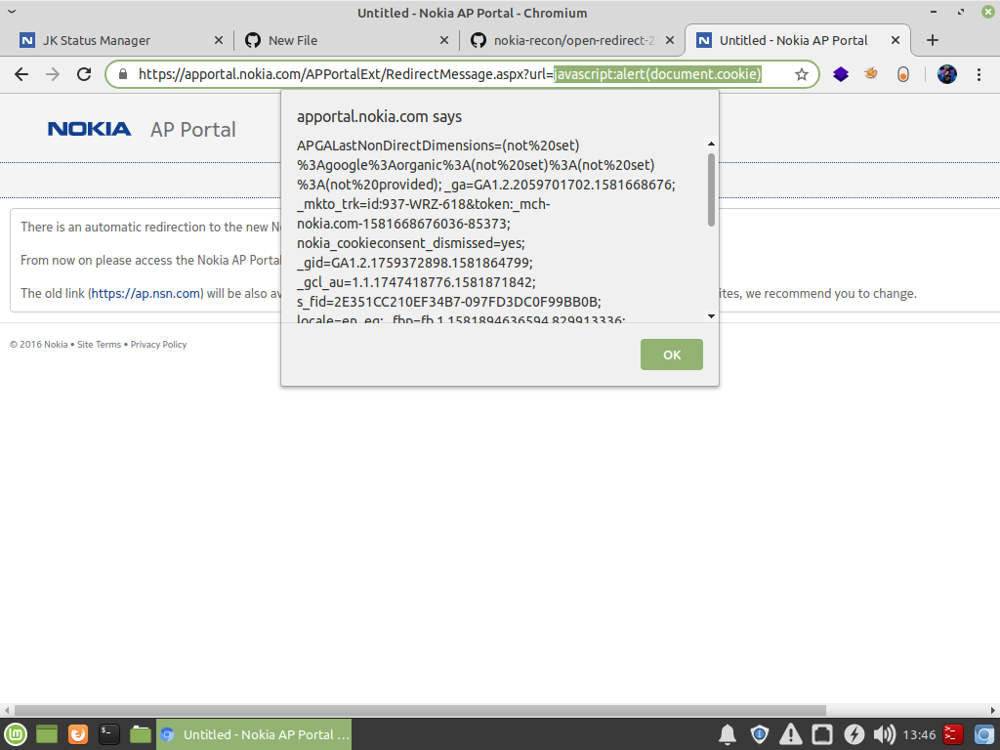

### hi reader :)
#### in this <a href='https://github.com/knassar702/nokia-recon/blob/master/reports/low/open-redirect-25-10-2019.md'>report</a> i have found open redirect but the impact very low .. let's change it from low to medium ^_^

## Steps To Reproduce :
* go to this <a href='https://apportal.nokia.com/APPortalExt/RedirectMessage.aspx?url='>link</a>
* Enter this payload `javascript:alert(document.cookie)` in `url` parameter
### Boooom

### Recommendations for fix
* Content based escaping on the users input
## impact
##### With the help of xss a hacker or attacker can perform social engineering on users by redirecting them from real website to fake one. hacker can steal their cookies and download a malware on their system, and there are many more attacking scenarios a skilled attacker can perform with xss.
