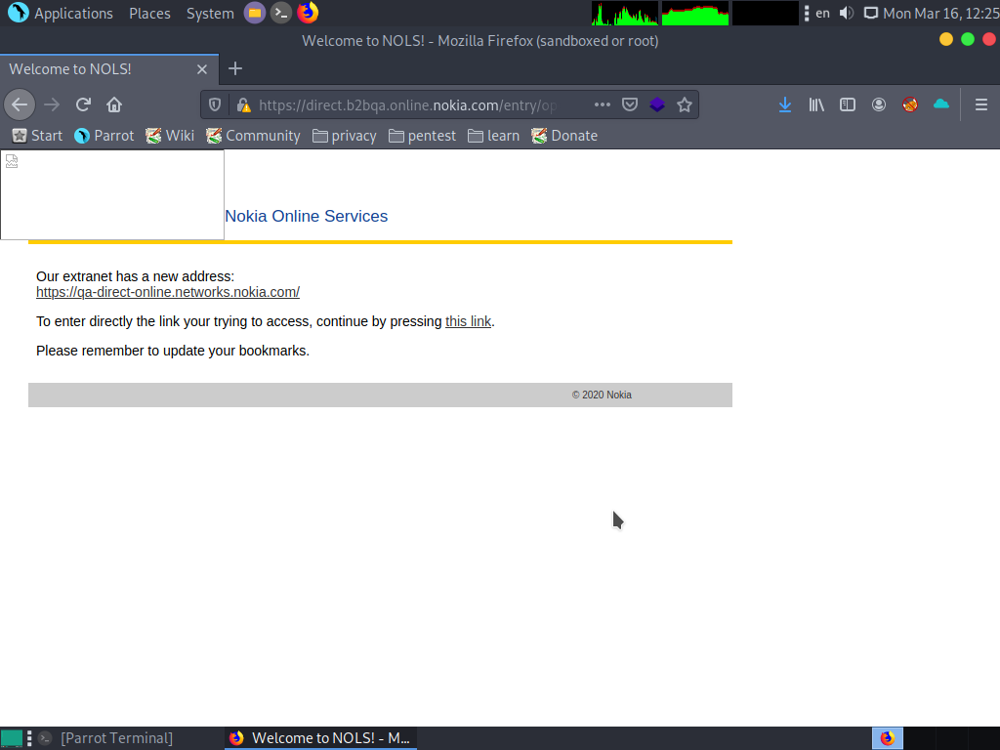
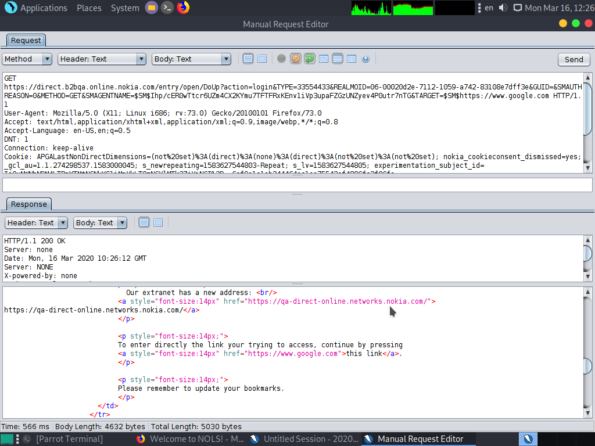
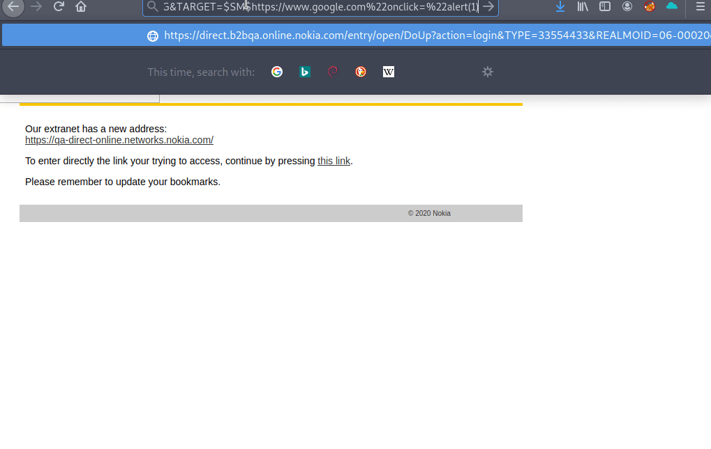

### hi team i've found xss refelected in https://direct.b2bqa.online.nokia.com

#### Steps :
  * go to this <a href='https://direct.b2bqa.online.nokia.com/entry/open/DoUp?action=login&TYPE=33554433&REALMOID=06-00020d2e-7112-1059-a742-83108e7dff3e&GUID=&SMAUTHREASON=0&METHOD=GET&SMAGENTNAME=$SM$Ihp/cER0wTtcr6UZm4CX2KYmu7TFTFRxKEnv1iVp3upaFZGzUNZyev4P0utr7nTG&TARGET=$SM$https://knassar702.github.io'>link</a>
  * enter this payload `http://google.com"onclick="alert(1)`in `target` parameter 
  
#### Screen shot

## All Data of target parameter in a tag `<a href='{TARGET PARAEMTER}'>`

## Try To get xss Reflected

## Demo

