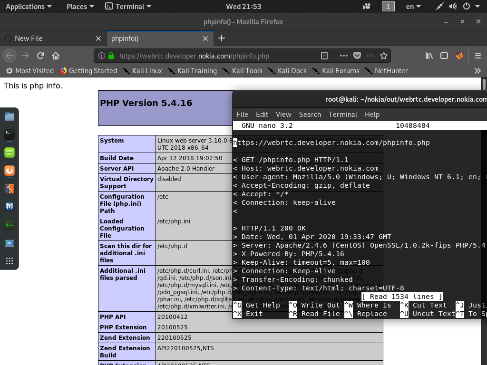

## how to get this file

im using this tool for fetch all paths <a href='https://github.com/knassar702/opener'>Open3r</a>

## Command
`$ cat hosts | python3 open3r -p /phpinfo.php -n 200`

### hoo hooo 

