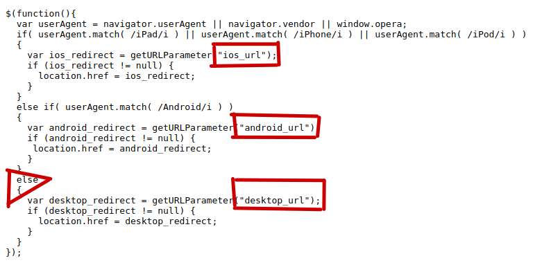

#### hi when i visiting this link http://static.health.nokia.com/content/crm/redirect_url/ you can see this page


### hmmm lets reading js files :v
#### in this file `http://static.health.nokia.com/content/crm/redirect_url/js/detect_device.js` you can see this lines



#### from this code you can redirect the user to any website

#### if the vicitm using ios you need ios_url parameter

```javascript
    var ios_redirect = getURLParameter("ios_url");
    if (ios_redirect != null) {
      location.href = ios_redirect;
    }
```
#### Android you need android_url parameter

```javascript
  else if( userAgent.match( /Android/i ) )
  {
    var android_redirect = getURLParameter("android_url");
    if (android_redirect != null) {
     location.href = android_redirect;
    }
  }
```

#### others os you need desktop_url parameter

```javascript
  {
    var desktop_redirect = getURLParameter("desktop_url");
    if (desktop_redirect != null) {
      location.href = desktop_redirect;
    }
  }
```

#### you can add all parameters in the url like this `http://static.health.nokia.com/content/crm/redirect_url/?desktop_url=http://google.com&android_url=http://google.com&ios_url=http://google.com` boom worked in all devices

#### impact is very low :(
#### hmmm let's change it from open redirect to xss reflected using this payload `javascript:alert('@knassar702')`


